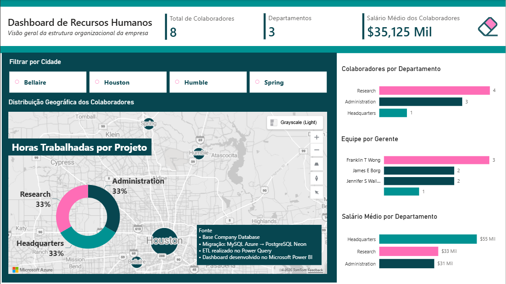
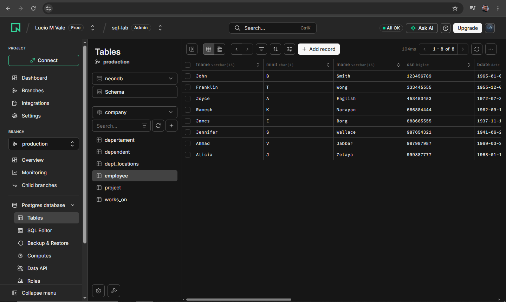
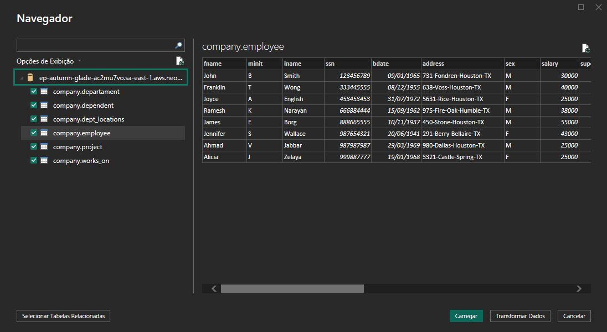

# HR Analytics Dashboard | Company Database

Migration from **MySQL (Azure)** to **PostgreSQL (Neon)**, ETL with **Power Query**, and an interactive **HR Analytics Dashboard** developed in **Microsoft Power BI**.

---

# Dashboard



---

# Overview

This project demonstrates the complete implementation of a Business Intelligence solution based on the classic **Company Database**.

The project covers the entire analytical workflow, including:

- Database migration from MySQL to PostgreSQL
- Database deployment on Neon
- ETL process using Microsoft Power Query
- Data transformation and enrichment
- Analytical data modeling
- Interactive dashboard development in Microsoft Power BI
- Technical documentation

---

# Technologies

- PostgreSQL
- Neon Database
- SQL
- Microsoft Power Query
- Microsoft Power BI
- GitHub

---

# Project Workflow

```
MySQL (Azure)
        │
        ▼
PostgreSQL (Neon)
        │
        ▼
SQL Scripts
        │
        ▼
Power Query (ETL)
        │
        ▼
Analytical Table
        │
        ▼
Power BI Dashboard
```

---

# Database Migration

The original Company Database was available in **MySQL (Azure)**.

All SQL scripts were adapted to PostgreSQL syntax and executed in a **Neon PostgreSQL** environment.

## Neon Database



## Database Connection



---

# Repository Structure

```
company-hr-dashboard
│
├── README.md
├── company.pbix
├── company_dataset.xlsx
│
├── assets
│   ├── painel.png
│   ├── neon_console.png
│   └── host_console.png
│
└── sql
    ├── company_postgresql.sql
    └── inserts_into.sql
```

---

# Database Setup Guide (PostgreSQL / Neon)

## 1. Create the Schema

Execute:

```sql
DROP SCHEMA IF EXISTS company CASCADE;

CREATE SCHEMA company;

SET search_path TO company;
```

---

## 2. Create the Tables

Execute every **CREATE TABLE** statement available in:

```
sql/company_postgresql.sql
```

---

## 3. Load the Data

Before running the insert script:

Remove (or comment):

```sql
USE company_constraints;
```

Add:

```sql
SET search_path TO company;
```

Execute the INSERT statements in the following order:

1. employee
2. dependent
3. department
4. dept_locations
5. project
6. works_on

---

## 4. Create Foreign Keys

After all INSERT statements execute successfully, run every:

```sql
ALTER TABLE
ADD CONSTRAINT ...
```

statement.

---

## 5. Validate the Database

Expected number of records:

| Table | Rows |
|-------|-----:|
| employee | 8 |
| department | 3 |
| project | 6 |
| works_on | 16 |
| dependent | 7 |

Example:

```sql
SELECT COUNT(*) FROM employee;
```

or

```sql
SELECT * FROM employee;
```

---

## 6. Execute SQL Queries

Only after validating the database should the SQL queries be executed.

---

# Common Issues

### relation already exists

The table already exists.

---

### constraint already exists

The foreign key already exists.

---

### USE company_constraints

This command is supported by MySQL only.

In PostgreSQL use:

```sql
SET search_path TO company;
```

---

### Wrong Schema

Always verify:

```sql
SET search_path TO company;
```

---

# ETL Process (Power Query)

The ETL process was performed entirely in **Microsoft Power Query**.

Main transformations:

- Data type conversion
- Address field normalization
- Address split into:
  - House Number
  - Street
  - City
  - State
- Column renaming
- Employee full name creation
- Manager full name creation
- Data enrichment using Merge operations
- Removal of temporary columns
- Creation of a consolidated analytical table

---

# Why Merge Instead of Append?

The ETL process relied primarily on **Merge Queries**.

Merge was used because the objective was to enrich existing records through relational keys such as:

- SSN
- SUPER_SSN
- DNO

Append was intentionally avoided because it stacks rows vertically, while this project required combining related information horizontally.

---

# Analytical Dataset

The final analytical table (**emplo & depart**) consolidates information from multiple Company Database tables, including:

- Employee
- Department
- Manager
- Salary
- Address
- Projects
- Hours Worked

This denormalized structure simplifies report creation and improves dashboard performance.

---

# Dashboard

The Power BI dashboard provides an overview of the organization's Human Resources structure.

Main indicators:

- Total Employees
- Number of Departments
- Average Salary

Analytical visuals:

- Geographic Distribution of Employees
- Hours Worked by Project
- Employees by Department
- Team Distribution by Manager
- Average Salary by Department

---

# Main Insights

- Research contains the largest number of employees.
- Headquarters has a single employee.
- Employee distribution can be analyzed by manager hierarchy.
- Geographic visualization highlights workforce dispersion.
- Salary comparison is available across departments.

---

# Files

| File | Description |
|------|-------------|
| company.pbix | Power BI Dashboard |
| company_dataset.xlsx | Analytical dataset |
| company_postgresql.sql | PostgreSQL database creation |
| inserts_into.sql | Database load |
| README.md | Project documentation |

---

# Author

**Lúcio do Vale**

Business Intelligence • Data Analytics • SQL • PostgreSQL • Microsoft Power BI

---

# Credits

This project was developed using the classic **Company Database** as the reference dataset.

The original database was migrated from **MySQL** to **PostgreSQL (Neon)**, followed by an ETL process using **Power Query** and dashboard development in **Microsoft Power BI**.
